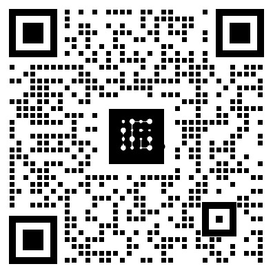

<div align="center">
  <h1>Multimodal Fine-Tuning Data Generator</h1>
  <p><em>Upload images to generate JSONL training data for multimodal fine‑tuning</em></p>
  <span><a href="./README_zh.md">中文</a> | English</span>
</div>

## Overview

This project generates JSONL training data from images, with a simple frontend UI.

## Demo


https://github.com/user-attachments/assets/d7343b42-9321-4b61-b12d-c236c9ec3f28


<!-- Add demo content or screenshots here if available -->

## Quick Start

### One‑click scripts
Linux/macOS:
```bash
cd backend
bash start.sh
```
Windows:
```bash
cd backend
start.bat
```

## FAQ

- Q: Which image formats are supported?
  - A: JPG, PNG, WebP. Recommended size < 10MB per image.
- Q: How to process a large batch of images?
  - A: You can upload multiple images at once; recommend ≤ 50 per batch.
- Q: Where are the generated files stored?
  - A: In `backend/outputs/` on the server, and they are auto‑downloaded to your computer.
- Q: Can I customize the output data format?
  - A: Yes. Modify `create_training_data` in `backend/app.py`.

## Contributing

Issues and PRs are welcome for feature improvements, bug fixes, and documentation.

## Community

Explore our community (Chinese): 👉 [Tech Community | Fufan Space](https://kq4b3vgg5b.feishu.cn/wiki/JuJSwfbwmiwvbqkiQ7LcN1N1nhd)

<div align="center">

<div>
